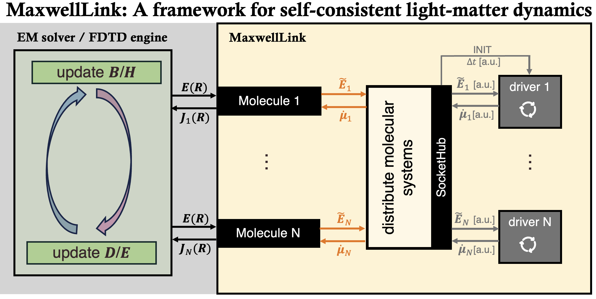

Introduction
============

**MaxwellLink** provides a flexible software bridge between electromagnetic (EM) solvers, 
such as finite-difference time-domain (FDTD) approach, and quantum or classical molecular dynamics
engines. The toolkit originated in the `TEL Research Group <https://www.taoeli.org>`_ at
University of Delaware and is designed for self-consistent light-matter simulations in which both the EM and
molecular subsystems evolve using state-of-the-art computational methods. 

**MaxwellLink** can be used for both demonstration and production purposes. With a single laptop, we can use **MaxwellLink**
to prototype light-matter dynamics involving model systems or first-principles quantum dynamics. On
high-performance computing clusters, **MaxwellLink** can couple a parallel FDTD solver with hundreds of molecular drivers
running across networked nodes using a TCP socket interface.

Key capabilities
~~~~~~~~~~~~~~~~~~~

- Simplified and **unified Python API** for self-consistent light-matter simulations.
- Couple an EM solver (such as Meep FDTD or a single-mode cavity) to one or many molecular
  drivers running in the same process or across networked nodes via **TCP sockets**.
- Mix **heterogeneous molecular theories** within a single EM simulation, ranging from
  two-level systems (TLSs), QuTiP model Hamiltonians, to Psi4-based RT-TDDFT,
  Ehrenfest dynamics, and ASE- and LAMMPS-powered molecular mechanics.
- Tolerate driver pauses or restarts — the ``SocketHub`` automatically waits for
  reconnections before resuming a simulation step.
- Operate under MPI: only the master rank in the EM simulation speaks to the drivers 
  while field data and molecular response are broadcast to worker ranks.
- **Flexible to extend**: users can implement custom molecular drivers or EM solvers
  by writing a few wrapper functions; see :doc:`contributing` for details.

Included EM solvers
~~~~~~~~~~~~~~~~~~~~~~~~~~~~~

- **Meep FDTD** – a popular (industry-standard) open-source FDTD package with a user-friendly 
  Python interface maintained by `MIT <https://meep.readthedocs.io/en/latest/>`_.
- **Single-mode cavity** – a simple 1D cavity mode solver with support for
  damping and external driving fields, useful for prototyping, debugging, and 
  simplified quantum optics and polaritonics calculations.
- **Laser driven dynamics** – a driver that applies arbitrary user-defined classical electric fields
  without back-action from the molecular system, useful for pump-probe and strong-field simulations.

Included molecular drivers
~~~~~~~~~~~~~~~~~~~~~~~~~~~

- **Model systems** – a lightweight TLS driver and a `QuTiP <https://qutip.org>`_ interface for custom
  Hamiltonians with optional Lindblad terms.
- **First-principles nonadiabatic quantum dynamics** – RT-TDDFT and
  RT-TDDFT-Ehrenfest drivers implemented using `Psi4 <https://psicode.org/>`_.
- **Classical or first-principles molecular mechanics** – ASE drivers that wrap any
  `ASE <https://ase-lib.org/index.html>`_ calculator (including `Psi4 <https://psicode.org/>`_,
  `ORCA <https://www.faccts.de/orca/>`_, `DFTB+ <https://www.dftbplus.org/>`_) and a `LAMMPS <https://www.lammps.org/>`_ plugin using
  ``fix mxl``.

Learning path
~~~~~~~~~~~~~~~

1. :doc:`installation` walks through the recommended conda environment and
   optional driver dependencies.
2. :doc:`agent_skills` provides a simple way to get started with **MaxwellLink** using natural language prompts.
3. :doc:`usage` shows how to launch a `Meep <https://meep.readthedocs.io/en/latest/>`_ simulation, connect a TLS driver, and
   inspect the returned molecular data.
4. :doc:`tutorials/index` provides hands-on tutorials regarding setting up and using
   **MaxwellLink** with different EM solvers and drivers.
5. :doc:`architecture` explains the socket protocol, molecular wrappers, and how
   **MaxwellLink** keeps the EM solver and drivers synchronized.
6. :doc:`em_solvers/index` documents all shipped EM solvers, their required
   parameters, and expected outputs.
7. :doc:`drivers/index` documents all shipped molecular drivers, their required
   parameters, and expected outputs.
8. :doc:`contributing` guides users on how to implement custom EM solvers
   and molecular drivers to extend the **MaxwellLink** framework.
9. :doc:`api/modules` lists the complete API reference for all **MaxwellLink** classes and functions.